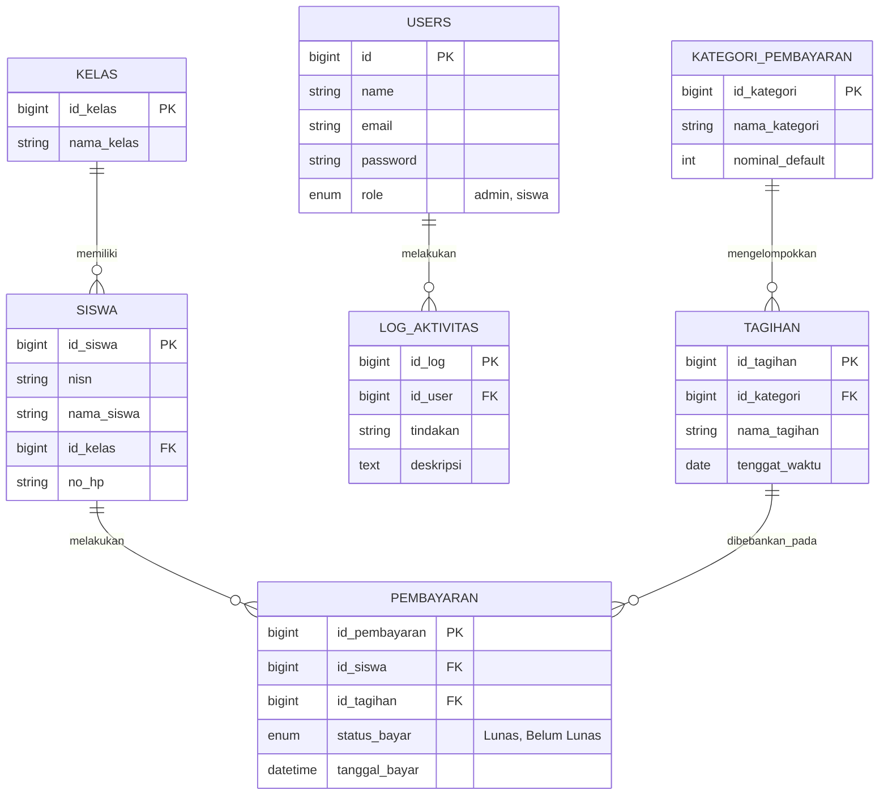

# LAPORAN TUGAS BESAR
**UJIAN AKHIR SEMESTER (UAS)**
**Mata Kuliah: Pemrograman Web 2**

    

    

**Studi Kasus:**
### SISTEM KEUANGAN SEKOLAH (My-SPP)

    

**Disusun Oleh:**
[NAMA MAHASISWA]
[NIM MAHASISWA]

  

**Dosen Pengampu:**
Ipan Saepul Milal, S.Kom.

    

**PROGRAM STUDI [NAMA JURUSAN]**
**[NAMA UNIVERSITAS / KAMPUS]**
**2026**

## 1. Analisis Sistem

**My-SPP** adalah sebuah aplikasi web "Sistem Keuangan Sekolah" yang dikembangkan menggunakan *framework* Laravel dengan konsep *Fullstack Development*. Sistem ini berfokus pada digitalisasi proses pengelolaan, pencatatan, dan pelaporan Sumbangan Pembinaan Pendidikan (SPP). 

Sistem ini dirancang untuk menyelesaikan permasalahan pencatatan manual dengan menyediakan dua antarmuka (hak akses) utama:
1. **Admin / Kasir**: Memiliki wewenang penuh untuk mengelola data master (Kelas, Siswa, Kategori Tagihan), mendistribusikan tagihan SPP bulanan, menerima pembayaran (Kasir Cepat), melihat statistik dasbor, serta mengekspor laporan keuangan.
2. **Siswa**: Memiliki portal mandiri untuk melihat riwayat tagihan yang sudah lunas maupun yang menunggak secara transparan, serta mengatur profil komunikasi.

Selain memenuhi 100% spesifikasi wajib UAS, aplikasi ini juga diintegrasikan dengan beberapa fitur tingkat lanjut (*Advanced*) seperti **WhatsApp Gateway** (sebagai notifikasi pelunasan otomatis ke wali murid), **Activity Log** (Audit Trail transaksi kasir), dan perlindungan bug melalui **Automated QA Testing**.

---

## 2. Struktur Database

Database sistem ini (minimal 5 Tabel Master, Relasi One-to-Many, dan Many-to-Many) telah direpresentasikan ke dalam struktur *Entity Relationship Diagram* (ERD) berikut:

---

## 3. Implementasi

Aplikasi ini diimplementasikan menggunakan arsitektur MVC (Model-View-Controller) bawaan Laravel. Berikut adalah rincian pemenuhan kriteria Ujian Akhir Semester:

### A. Fitur Wajib (Telah Terpenuhi)
1. **Authentication**: Menggunakan Laravel Breeze. Terdapat fitur Login, Logout, dan pengamanan rute menggunakan *Middleware* Role (Admin dan Siswa).
2. **Database & Migration**: Diimplementasikan menggunakan fitur Migration, Factory, dan Seeder Laravel untuk *generate* data otomatis.
3. **CRUD & Search**: Terdapat lebih dari 5 modul CRUD (Kelas, Siswa, Kategori, Tagihan, Pembayaran). Dilengkapi fitur *Search Data* bawaan.
4. **Dashboard**: Menampilkan total data (Siswa, Tagihan) dan Grafik Statistik Pemasukan menggunakan pustaka **Chart.js**.
5. **Export Data**: Laporan keuangan dapat diekspor menjadi format Excel (.csv) dan dokumen PDF menggunakan library `barryvdh/laravel-dompdf`.
6. **User Interface (UI)**: Dibangun menggunakan kerangka kerja CSS modern (Tailwind CSS/Bootstrap).

### B. Nilai Tambahan (Telah Terpenuhi)
Sistem ini berhasil melampaui ekspektasi dengan menerapkan **3 Fitur Nilai Tambahan** sekaligus:
1. **WhatsApp Gateway**: Integrasi Fonnte API untuk mengirimkan pesan resi/kwitansi secara *real-time* ke nomor WhatsApp orang tua segera setelah Kasir menekan tombol "Lunas".
2. **Activity Log / Audit Trail**: Setiap kali kasir menerima uang, sistem akan secara diam-diam mencatat siapa kasirnya dan kapan waktu transaksinya untuk menghindari penggelapan dana.
3. **Automated Feature QA Testing**: (Bonus) Aplikasi telah dibentengi oleh 16 Skenario Pengujian Otomatis (*Unit & Feature Test*) berskala industri untuk memastikan keamanan 100%.

---

## 4. Screenshot Sistem

*(Catatan: Silakan Anda masukkan gambar *screenshot* (tangkapan layar) asli dari laptop Anda untuk melengkapi bagian ini pada laporan PDF final Anda)*

### 4.1. Halaman Login
> *[HAPUS TEKS INI DAN MASUKKAN GAMBAR SCREENSHOT HALAMAN LOGIN DI SINI]*

### 4.2. Dashboard Admin (Grafik Statistik)
> *[HAPUS TEKS INI DAN MASUKKAN GAMBAR SCREENSHOT DASHBOARD ADMIN YANG ADA GRAFIKNYA DI SINI]*

### 4.3. Modul Data Siswa (CRUD)
> *[HAPUS TEKS INI DAN MASUKKAN GAMBAR SCREENSHOT TABEL SISWA DI SINI]*

### 4.4. Transaksi Kasir Pembayaran
> *[HAPUS TEKS INI DAN MASUKKAN GAMBAR SCREENSHOT HALAMAN KASIR/PEMBAYARAN DI SINI]*

### 4.5. Laporan Keuangan (Export PDF/Excel)
> *[HAPUS TEKS INI DAN MASUKKAN GAMBAR SCREENSHOT HALAMAN LAPORAN KEUANGAN DI SINI]*

### 4.6. Notifikasi WhatsApp (Nilai Tambah)
> *[HAPUS TEKS INI DAN MASUKKAN GAMBAR SCREENSHOT BUKTI PESAN WA YANG MASUK DI SINI, JIKA ADA]*

---

## 5. Kesimpulan

Pengembangan sistem **My-SPP** ini membuktikan bahwa kerangka kerja Laravel sangat tangguh untuk digunakan dalam membangun *Enterprise Web Application*. Pemisahan antara *Model, View, dan Controller* membuat logika keuangan yang rumit menjadi sangat rapi dan mudah diuji (*Testable*).

Aplikasi ini tidak hanya berhasil memenuhi 100% persyaratan minimum spesifikasi Tugas Besar UAS (Sistem Keuangan Sekolah), tetapi juga sangat aplikatif untuk diterapkan di dunia nyata berkat hadirnya pengaman transaksi (*Audit Trail*) dan layanan modern berupa Notifikasi WhatsApp (Gateway). Secara keseluruhan, proyek ini sangat sukses mendigitalisasikan prosedur pembayaran SPP konvensional menjadi sistem modern yang transparan, aman, dan efisien.
